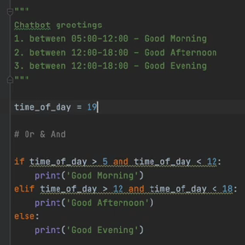

# Python Fundamentals

## Topic Overview

### Introduction
- Course Overview
  1. Setting up your machine
  2. Data Types and Operators
  3. Strings and String manipulation
  4. Variables
  5. Collections
  6. Control Flow
  7. Loops
  8. Function

### Course Setup

- Python Installation - Mac
  - Please follow this link: [https://www.python.org/downloads/](https://www.python.org/downloads/)
- Python Installation - Windows
  - Please follow this link: [https://www.python.org/downloads/](https://www.python.org/downloads/)

- Pycharm Installation
  - Please follow this link: [https://www.jetbrains.com/pycharm/download/?section=windows](https://www.jetbrains.com/pycharm/download/?section=windows)

- First Python Project
   - Short Introduction of virtual environment
     - A virtual environment captures a local version within that folder (called venv) of Python itself
   - First Project: `print("Hello World!")`
     1. Create a new file by right-clicking on the folder, where you would like to store your file
     2. Select `New` and then `File`
     3. Enter the name of the File with the extension `.py` for Python: `hello_world.py`
     4. Type `print("Hello World!")` and click on the play button
     5. You should receive the following in your terminal: 
     

     Congratulations! You have written your first code!

- Commenting Code
  - It is important to add comments as this can help another person to understand your code
  - You can comment code in different ways:
    - Adding a hashtag at the start of your comment: 
    
    - You can also add in-line comments: 
    
    - You can also add multi-line string as this can be used as a comment as well: 
    

    
  

### Data Types

- Data Types Intro
  - Integers/Floats:
    - Integers are whole numbers
    - Floats are decimal numbers
  - Strings:
    - Strings consist of a combination of characters
    - They always need to be in single or double quotes
  - Boolean:
    - Boolean can only store one of two values, namely True or False
    - Make sure to capitalise them as it will not be recognised as a boolean otherwise

- Numbers and Math Operators
  - Math Operators: `+`, `-`, `*`, `/`, `%`:
    - You can use these operators to conduct mathematical calculations with integers and floats
    - Please bear in mind that `10` and `"10"` is NOT the same. 
      `10` is an integer (whole number)
      `"10"` is a string -- in order to use a string for calculations, you will need to cast it into a integer `int()` or into a float `float()` first

  - Built-In Function: `type()`
    - This function will show you the type of your output:
    
 

    

- String Basics
  - Unicode Characters
    - The Python Interpreter does not see words like we do. It sees a group of Unicode characters put together in a particular sequence.
      Unicode is a standard for representing text in computers. It assigns a unique number to every character in every language, including symbols and emojis.
  - Indexing
    - This is useful if you would like to access a particular part of a string, list etc.
    - We use square brackets for this `[]`
    - The first character starts with the index `0` 
    - The first index is the starting index, which is included
    - The last index is the ending index, which is excluded 
      
 

    - As we can see, we were able to slice the string by indexing `[0:5]` which returned `Hello`
  - Strings are immutable, which means you can not change them. In order to store the changed string, you will need to store it in another variable
  - Built-In Function: `len()`
    - The len() function returns the length of a string

- Boolean & Equality Operators
  - Equality Operators: `==`, `!=`, `>`, `<`, `>=`, `<=`
    - These operators can help to compare values:
      
      
      

### Variables

- Variables Introduction
  - Variables are containers to store data, which can be referred back to
  - the assignment operator (=) as we are assigning a value/string
  - variable names need to be lower case
  - variable names should have underscores instead of spaces
  - they should have a descriptive name
  - Python Style Guide: [https://peps.python.org/pep-0008/](https://peps.python.org/pep-0008/)

### More on Strings

- Concatenation & Escape Characters
  - You can add strings to one another using the `+` operator (Please bear in mind that you cannot concatenate a string with a non-string using this method): 
    
  - You can also use the f-string method: 
    
  - You can also use the format() method: 
    
  - The output will be the same for all 3 options: 
    

  - Python uses the backslash `\` as an escape character:
    - `\n` = Newline - inserts a new line
    - `\t` = Tab - inserts a tab
    - `\s` = inserts a space

- String Methods
  - There are different methods to manipulate strings such as:
    - .upper() = converts string to uppercase
    - .lower() = converts string to lowercase
    - .strip() = removes any whitespace from the start and the end of the string
    - .replace('oldText', 'newText') = replaces any occurrences of 'oldText' with 'newText' 
  - Further Python String Methods: [https://docs.python.org/3/library/stdtypes.html#string-methods](https://docs.python.org/3/library/stdtypes.html#string-methods)

### Control Flow

- This refers to the order in which the individual statements of a program are executed
- We use conditional statements for this, also called if-elif statements
- These are used to execute different blocks of code based on whether a certain condition is true or false. 
  

### Collections

- Lists
  - A list allows you to create a list of values, which can be of any data type
  - They are index based, which means that each value can be found by its index
    
  
- Dictionaries
  - A dictionary is based on `{key: value}` pairs
  - Elements in dictionaries are access via keys
  - The key must be immutable (can be any data type other than a list or a dictionary) and unique
  - The value can be of any data type

### Loops

- While Loops
  - A while loop takes a code block and keeps executing it while a given condition stays `True`
  - The while statement repeats its action until this controlling condition becomes `False`
  - These statements need to be indented in the loop
  - A while loop starts with `while` followed by a boolean expression
  - It can run the risk of running forever if the condition never becomes `False`. This is called infinite loop.
  - To avoid an infinite loop, make sure your while loop condition eventually becomes `False` and that your loop is exited

- For Loop
  - A for loop is a counter-controlled loop, which means that the number of repetitions in a for loop is known a head of time
  - In each iteration (or repetition) of the for loop the code that is indented is repeated
  - A for loop starts with `for` followed by a variable that will hold each of the values of the sequence as we iterate through it

### Functions

- Functions allow us to write block of codes that break our code down into smaller modular parts
- They help our program to be more organised and makes our code reusable
- To create a function you need to start with `def` followed by the name of our function followed by parentheses
- Everything belonging to the functions needs to be indented:
  
- In order to execute a function, you will need to call the function:

