# Python Fundamentals

## Topic Overview

### Introduction
- Course Overview
  1. Setting up your machine
  2. Data Types and Operators
  3. Strings and String manipulation
  4. Variables
  5. Collections
  6. Control Flow
  7. Loops
  8. Function
  9. Bringing it all together

### Course Setup

- Python Installation - Mac
  - Please follow this link: [https://www.python.org/downloads/](https://www.python.org/downloads/)
- Python Installation - Windows
  - Please follow this link: [https://www.python.org/downloads/](https://www.python.org/downloads/)

- Pycharm Installation
  - Please follow this link: [https://www.jetbrains.com/pycharm/download/?section=windows](https://www.jetbrains.com/pycharm/download/?section=windows)

- First Python Project
   - Short Introduction of virtual environment
     - A virtual environment captures a local version within that folder (called venv) of Python itself
   - First Project: `print("Hello World!")`
     1. Create a new file by right-clicking on the folder, where you would like to store your file
     2. Select `New` and then `File`
     3. Enter the name of the File with the extension `.py` for Python: `hello_world.py`
     4. Type `print("Hello World!")` and click on the play button
     5. You should receive the following in your terminal:
     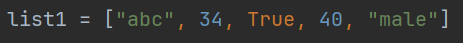
     Congratulations! You have written your first code!

- Commenting Code
  - It is important to add comments as this can help another person to understand your code
  - You can comment code in different ways:
    - Adding a hashtag at the start of your comment:
    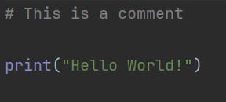
    - You can also add in-line comments:
    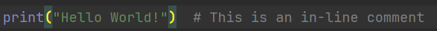
    - You can also add multi-line string as this can be used as a comment as well:
    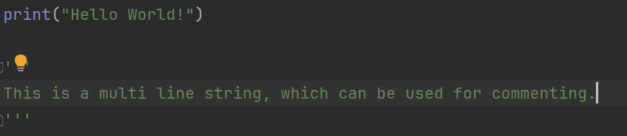
    
  

### Data Types

- Data Types Intro
  - Integers/Floats:
    - Integers are whole numbers
    - Floats are decimal numbers
  - Strings:
    - Strings consist of a combination of characters
    - They always need to be in single or double quotes
  - Boolean:
    - Boolean can only store one of two values, namely True or False
    - Make sure to capitalise them as it will not be recognised as a boolean otherwise

- Numbers and Math Operators
  - Math Operators: `+`, `-`, `*`, `/`, `%`:
    - You can use these operators to conduct mathematical calculations with integers and floats
    - Please bear in mind that `10` and `"10"` is NOT the same. 
      `10` is an integer (whole number)
      `"10"` is a string -- in order to use a string for calculations, you will need to cast it into a integer `int()` or into a float `float()` first

  - Built-In Function: `type()`
    - This function will show you the type of your output:
    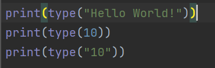 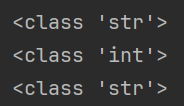
    

- String Basics
  - Unicode Characters
    - The Python Interpreter does not see words like we do. It sees a group of Unicode characters put together in a particular sequence.
      Unicode is a standard for representing text in computers. It assigns a unique number to every character in every language, including symbols and emojis.
  - Indexing
    - This is useful if you would like to access a particular part of a string, list etc.
    - We use square brackets for this `[]`
    - The first character starts with the index `0` 
    - The first index is the starting index, which is included
    - The last index is the ending index, which is excluded
      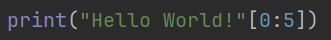 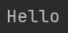
    - As we can see, we were able to slice the string by indexing `[0:5]` which returned `Hello`
  
  - Built-In Function: `len()`
    - The len() function returns the length of a string

- Boolean & Equality Operators
  - Equality Operators: `==`, `!=`, `>`, `<`, `>=`, `<=`
    - These operators can help to compare values:
      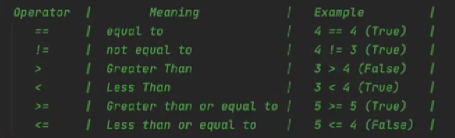
      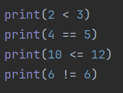
      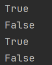

### Variables

- Variables Introduction
  - Variables are containers to store data, which can be referred back to
  - the assignment operator (=) as we are assigning a value/string
  - variable names need to be lower case
  - variable names should have underscores instead of spaces
  - they should have a descriptive name
  - Python Style Guide: [https://peps.python.org/pep-0008/](https://peps.python.org/pep-0008/)

### More on Strings

- Concatenation & Escape Characters
  - You can add strings to one another using the `+` operator (Please bear in mind that you cannot concatenate a string with a non-string using this method):
    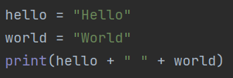
  - You can also use the f-string method:
    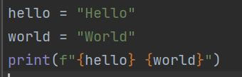
  - You can also use the format() method:
    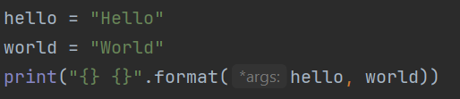
The output will be the same for all 3 options:
    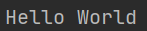

- String Methods
  - Python String Methods: [https://docs.python.org/3/library/stdtypes.html#string-methods](https://docs.python.org/3/library/stdtypes.html#string-methods)

### Control Flow

- Control Flow Introduction
- Control Flow Exercise

### Collections

- Collections Introduction
- Lists
- Dictionaries

### Loops

- Loops Introduction
- While Loops
- Number Guessing Game
- For Loop

### Functions

- Functions Introduction

